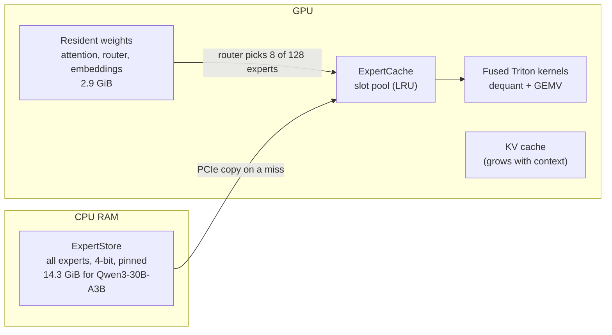

# Architecture

WiSP Runtime runs a Mixture-of-Experts (MoE) model whose weights do not fit in GPU memory. The idea is the same as
virtual memory in an operating system: all experts live in CPU RAM, and only the experts a token actually uses are
copied to the GPU, where a cache keeps the recently used ones.



## Why this works for MoE

Qwen3-30B-A3B has 48 layers × 128 experts = 6,144 experts, but each token uses 8 experts per layer (about 3B of
the 30B parameters). Consecutive tokens tend to reuse the same experts: in the 8 GB benchmarks a cache of 590 slots
(under 10% of all experts) served 76% of expert requests. Only the misses cross PCIe: about 216 MB per token at 4-bit, compared
with roughly 9 GB per token if every offloaded weight had to be streamed each step.

## Components

| File | Role |
|---|---|
| `wisp/quant.py` | Group-wise round-to-nearest quantization (group 128) to 8/4/3/2 bits. One expert = one flat buffer `[codes, fp16 scales, fp16 mins]`. |
| `wisp/store.py` | `ExpertStore`: all experts of the model, quantized, in one pinned CPU tensor. Built once from the safetensors checkpoint and cached on disk (`$WISP_STORES`). |
| `wisp/cache_core.py` | `CacheCore`: torch-free bookkeeping (key → slot, LRU / working-set eviction, resizing). Shared with the trace simulator. |
| `wisp/cache.py` | `ExpertCache`: GPU slot pool plus asynchronous host-to-device copies on a side stream. Can be resized in place. |
| `wisp/moe.py` | `PagedMoEBlock`: drop-in replacement for the Hugging Face MoE layer. Routes, makes the selected experts resident, computes. `Runtime` holds the shared state. |
| `wisp/kernels.py` | Triton kernels that read 4-bit / 3-bit experts straight from the slot pool: one launch for gate+up of all 8 experts, one for down + weighted sum. Also a one-launch rotary embedding for decode. |
| `wisp/model.py` | Builds the model skeleton with only non-expert weights on the GPU; patches RMSNorm and decode attention to cut kernel launches. |
| `wisp/graphdec.py` | `GraphDecoder`: CUDA-graph decode over a static KV cache, chunked prefill into the same buffers, elastic resizing. |
| `wisp/budget.py` | Splits a VRAM budget between resident weights, KV cache, temporaries and expert slots. |
| `wisp/gptoss.py` | Adapter for gpt-oss (MXFP4 checkpoint → store, paged block). Not yet run on a GPU. |
| `wisp/runner.py` | Shared setup and timing helpers for the scripts. |
| `wisp/sim.py` | Trace-driven cache simulator (predicts hit rate and speed from a routing trace). |

## One decode step

For each of the 48 layers:

1. Attention runs on the GPU as usual (resident weights, KV cache).
2. The router picks 8 experts. Their ids and weights are copied to the CPU: this is the **one GPU→CPU sync per layer**.
3. The CPU looks the experts up in the cache. Misses get a free or evicted slot, and their bytes are copied from the
   store on a side stream.
4. Two fused kernels compute all 8 experts directly from the 4-bit slots, with no bf16 temporary.

Step 3 is a decision only the CPU can make, so a token has 48 unavoidable sync points. On a host with a slow CPU, the
time between them was dominated by Python and kernel-launch overhead, which is what the later optimizations target:

- **Fused kernels** (`WISP_FUSED=2`): dequantization and matmul in one pass, 2 launches per layer.
- **RMSNorm and attention patches** (`WISP_FASTNORM`, `WISP_FASTATTN`): fewer, larger kernels.
- **CUDA graphs** (`--graph`): everything between two sync points is recorded once and replayed with one launch.
  Attention then runs over a fixed-size KV buffer with a position mask.

## Elastic context

The KV cache and the expert cache compete for the same VRAM. At 8 GB, reserving a 32K-token KV cache up front
(3.3 GiB) leaves room for only about 3% of the experts. `GraphDecoder` therefore starts with a 4K-token buffer and
doubles it only when the conversation needs more. Before the KV grows, the expert cache shrinks, keeping its most
recently used experts. Earlier turns' KV is reused, so each turn only prefills the new tokens.

## Store layout

```
expert buffer (bits < 16), n = hidden × intermediate elements per matrix:
  [ codes: 3n·bits/8 bytes | scales: fp16 × 3n/128 | mins: fp16 × 3n/128 ]
  matrices in order: gate [I, H], up [I, H], down [H, I]
  4-bit: element e = low nibble of byte e/2 (e even) or high nibble (e odd)
  3-bit: little-endian bit stream, 8 codes in 3 bytes
```

Expert sizes for Qwen3-30B-A3B: bf16 9.0 MiB, 4-bit 2.39 MiB, 3-bit 1.83 MiB, 2-bit 1.27 MiB.
